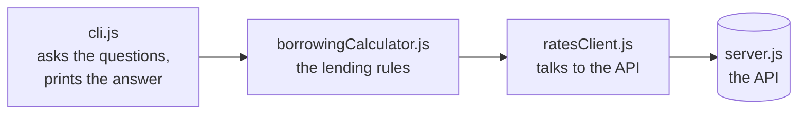
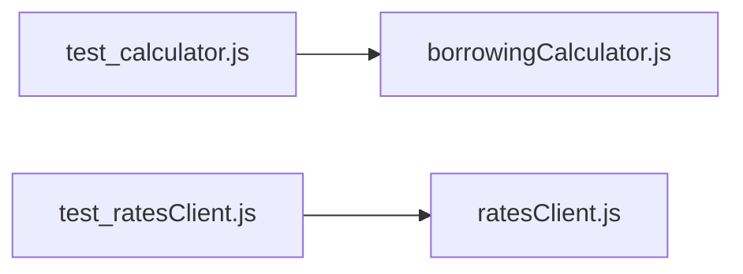

# Borrowing Power Calculator
 
A console app that works out roughly how much someone could borrow for a
30-year home loan, based on their income, number of dependents, monthly
expenses and credit card limits. The tax and HEM figures it needs come from the
development API in `server.js`.
 
## Before you start
 
You'll need Node 18 or later, because I used the built-in `fetch` rather than
adding a package like Axios, and `fetch` only became available by default in
Node 18.
 
```
node --version
npm install
```
 
Mocha is the only package this project installs.
 
## Running it
 
The API has to be running in its own terminal window, so start that first:
 
```
npm run api
```
 
Then open a second terminal and run the calculator:
 
```
npm start
```
 
A run looks like this:
 
```
Gross Annual Income: $120000
Number of Dependents: 2
Declared Monthly Expenses: $3000
Total Credit Card Limits: $10000
 
--- Calculation Summary ---
Maximum Borrowing Power at 7%: $524,173.77
Assumed Monthly Mortgage Repayment: $4,600.00 over 30 years
(Assessed at 10%, including a 3% buffer)
```
 
## Running the tests
 
```
npm test
```
 
You don't need the API running for this, and I've explained why further down.
 
## How the pieces fit together
 

 
`config.js` holds the API address and token along with the loan term, rate and
buffer, and `cli.js` reads it when it builds the other two.
 
The two test files replace one piece each with a fake, so neither of them needs
the API running:
 

 
## How I approached it
 
### Keeping the API calls separate from the maths
 
- Once I started swapping in real API calls, I found the whole thing easier to
  follow with the network code sitting somewhere separate from the calculation,
  since one goes out to a server and waits while the other just does arithmetic.
- They change for different reasons too, so a change to the API only touches
  `ratesClient.js` and a change to the lending rules only touches the
  calculator.
- Keeping them apart also made the calculation much easier to test.
### Handing the rates client to the calculator
 
- This is the choice I'd point to first, because it's the one that made the
  tests possible. `BorrowingPowerCalculator` doesn't build its own API client -
  it takes one as an argument: `new BorrowingPowerCalculator({ rates: someClient })`.
- Splitting the files alone wouldn't have helped, because a calculator that
  built its own client would still need the server running for every test.
- Passing it in means the tests can hand over something else instead, and
  anything with a `getTax` and a `getHEM` method will do, so mine pass a small
  object with two fake methods and no network at all.
- I did the same one level down, where `createRatesClient` takes a `fetchFn`
  that defaults to the normal `fetch`, letting the tests check the HTTP handling
  without a real server.
### A class for the calculator, a function for the client
 
- The exercise left this open, so I used a class for the calculator because it
  holds settings that belong together - loan term, interest rate, buffer, and
  where the rates come from.
- Putting those in the constructor means two calculators with different settings
  can exist at the same time, which the tests rely on.
- `ratesClient.js` is a plain function returning an object instead, since it's a
  thin wrapper around `fetch` that I can't picture extending, and that keeps the
  shared `request` helper hidden without needing `this`.
- A closure would have worked for the calculator too, and I went with the class
  because I think it reads more clearly, accepting that `this` behaves oddly if
  you pull a method off the object and pass it around on its own.
### Pulling the formula out on its own
 
- `presentValueOfAnnuity` sits outside the class because it's pure maths - the
  same three numbers always give the same answer - so testing it takes one line.
- I added a check for a zero interest rate, because the formula divides by the
  monthly rate and JavaScript quietly returns `Infinity` instead of raising an
  error, which would have meant a 0% rate reporting unlimited borrowing power.
- At 0% the loan is simply every repayment added together, so that's what the
  check returns.
### Everything having to become async
 
- Once tax and HEM come from a server the calculator can't answer straight away,
  so `calculate` returns a promise and the caller waits on it.
- That spreads outwards, which is why the tests supplied with the exercise
  stopped working the moment I connected the API - they were checking a promise
  rather than a result.
- The two calls don't need anything from each other, so I send them together
  with `Promise.all` rather than waiting for the first before starting the
  second. That wouldn't be possible if the second needed a value from the first.
### Where I catch errors
 
- `fetch` doesn't treat a 401 or a 500 as a failure and only rejects when it
  can't reach the server at all, which surprised me.
- Without checking the status myself, a bad token would have given me
  `undefined` where a tax figure should be, and that turns quietly into `NaN` at
  the end with nothing to show what went wrong.
- So `ratesClient` checks the status and throws an error including the code and
  whatever message the server sent back.
- It doesn't catch anything itself, since there's nothing sensible it can do
  about a server being down and it doesn't know whether a person is watching.
  `cli.js` catches instead, because that's the part that can say "check the API
  is running".
### The token
 
- `config.js` reads the API address and token from environment variables and
  falls back to the development values, so the project runs straight after
  cloning. You can override it to watch the error handling work:
  `RATES_API_TOKEN=wrong npm start`.
- It's a compromise, since the token is still in the repo, and I was only
  comfortable with that because this one is already published in `server.md`.
- For a real password I'd drop the fallback and let the app refuse to start when
  the variable is missing, so a misconfigured setup can't quietly run on a
  default.
## About the tests
 
- Neither test file needs the API running and everything finishes in under 10ms,
  which matters because a test then can't fail for a reason that has nothing to
  do with the code I wrote.
- `test_calculator.js` passes in a fake rates object with fixed numbers,
  covering the normal calculation, the HEM figure coming out higher than what
  was declared, the case where there's nothing left to repay a loan with, the
  assessment rate, the check that a rates client was supplied, and the formula
  on its own.
- `test_ratesClient.js` passes in a fake `fetch` and checks the address and
  `Authorization` header the client builds, not just the values it reads back -
  without that a wrong path or broken token header would still pass, since a
  fake answers any request you send it.
- Its error cases cover a 401, a 400 with the server's own message coming
  through, an error response that isn't valid JSON, and the server being
  unreachable.
### Two changes I made to the tests
 
- **4200 became 4600.** The placeholder took a flat 25% tax, which is $30,000 on
  a $120,000 income, whereas the real API works in tiers and returns $24,000, so
  monthly income after tax goes from $7,500 up to $8,000.
- The placeholder HEM of $2,800 was under the $3,000 declared so the declared
  figure was used, but the real HEM of $3,100 is higher and gets used instead,
  giving $8,000 - $3,100 - $300 = $4,600.
- The original test passed 7.5 in as the assessment rate directly, and since my
  version works that out from a base rate plus a buffer, those tests build it
  with `interestRate: 7.5, buffer: 0` so the rate is unchanged and the tax and
  HEM values are the only thing that's actually moved.
- **I renamed one test** so its name matched what it checks, since it passes no
  negative values but rather covers expenses coming out higher than someone can
  afford.
### What I haven't tested
 
- `cli.js` has no automated tests, because it's mostly asking questions,
  formatting dollars and joining the other pieces together, and testing it would
  have meant faking keyboard input for not much benefit.
- I checked it by hand instead: typing letters instead of numbers, stopping the
  server, and running it with a wrong token.
## Assumptions I made
 
- The four inputs are numbers and aren't negative, and `cli.js` asks again
  rather than giving up when they aren't.
- The server decides what counts as valid, so I didn't copy its rules into my
  own code, because then there'd be two versions of the same rule to keep in
  step with each other.
- The interest rate and buffer are settings rather than something the user types
  in, the same as in the original.
- The numbers are estimates, since the exercise says this is a simplified
  version that won't match the real Bendigo calculator, so I didn't try to match
  it.
## Things I'd still like to fix
 
- **Money is stored as a decimal number**, and while `toFixed(2)` makes it look
  right, anything actually moving money around would want to store whole cents
  instead.
- **The 7% rate is only ever displayed**, whereas a fuller version would show
  the real repayment at 7% next to the figure worked out at 10%.
- **The API quietly caps dependents at 3** and I don't mention it anywhere, so
  someone typing 5 is assessed as though they had 3 with nothing to tell them. I
  decided against putting the cap into my own code, since that rule belongs to
  the server and my copy of it would be wrong if it ever changed.
- **An empty answer counts as zero**, because that's what `Number('')` gives
  you.
- **There's no timeout on the API calls**, so a request that hangs would hang
  the whole app.
## AI
 
I used Claude as a thinking partner on this exercise. I started by understanding the domain, since I hadn't come across HEM or serviceability buffers before and wanted to know what the numbers meant before moving them around, and I used it to talk through the structural choice the exercise leaves open.

I wrote the first version of `ratesClient.js` myself and asked for a review, which caught three real bugs: query parameters in the path as well as in the params object, `/api` missing from both endpoints, and no `module.exports`. I used it the same way as I worked through the rest, and asked for line-by-line explanations so I understood each part rather than just accepting it.

The verification was all mine: exploring the endpoints with curl before writing any client code, working out why the original tests broke once the calculation became async, and checking the final numbers end to end against a live server.
 